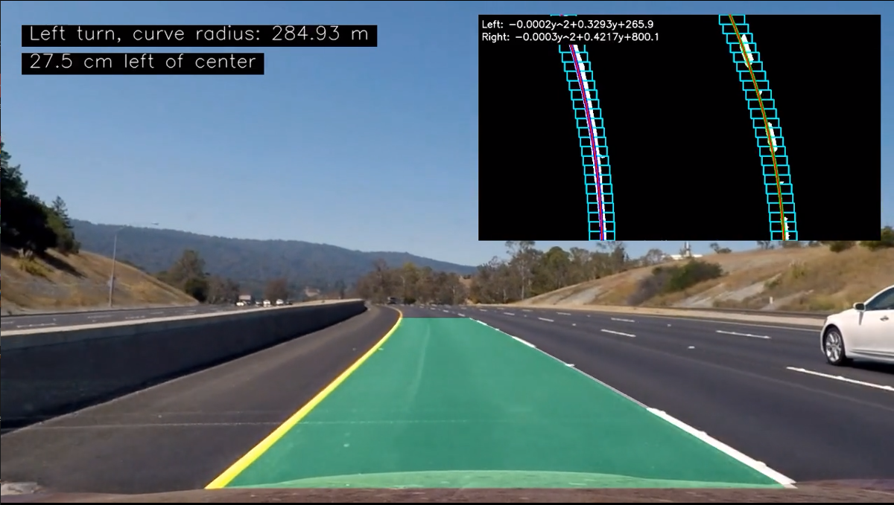

# 🚗 Lane Detection from Scratch (OpenCV + NumPy)

This project implements an advanced lane detection system **without using any machine learning models**, relying solely on classical computer vision techniques using **OpenCV** and **NumPy**. The pipeline processes video frames (or static road images) and detects lane boundaries, overlays them back on the road, and calculates lane curvature and vehicle position relative to the center.

---
**Note**: The parameters are based on the images I used for testing. Refer to [What to Change](lane_pipeline/change.txt) for more details.

## 📽️ Demo

> 📹 *Check out the lane detection in action below!*  
[](https://drive.google.com/file/d/1vWD7798FkGMFnbIDs0_xnnO9QUf1SkcO/view?usp=sharing)

---

## ▶️ How to Run

1. **Clone the repository:**

```bash
git clone https://github.com/Haseebasif7/Advance-Lane-Detection.git
cd Advance-Lane-Detection
```

2. **Install dependencies:**

Make sure you have Python installed. Then install the required libraries:

```bash
pip install -r requirements.txt
```

3. **Run the pipeline:**

```bash
python lane_pipeline/main.py
```


---

## 🧩 Pipeline Overview

The lane detection pipeline involves several key steps to transform raw camera data into accurate lane boundaries and provide useful information for autonomous driving systems. Here's an expanded breakdown of each step in the pipeline:

---

### 1️⃣ Camera Calibration

**Purpose**: The camera calibration step helps correct any distortion caused by the camera lens. Cameras, especially wide-angle ones, can introduce lens distortion (often called fisheye distortion), which causes straight lines in the real world to appear curved in the image.

**How it works**:
- We use a **set of chessboard images** taken from different angles. These images allow us to compute the **camera matrix** and **distortion coefficients**, which characterize how the camera distorts the images.
- With these parameters, we can undo the distortion, so the road and lane lines appear as they are in the real world, not warped by lens effects.

This correction is crucial for precise lane detection, as any distortion can lead to inaccurate lane marking detection and misinterpretation of road boundaries.

---

### 2️⃣ Distortion Correction

**Purpose**: After computing the camera matrix and distortion coefficients, we apply a **distortion correction** to the images.

**How it works**:
- Using the calibration parameters from the previous step, we apply an algorithm (typically `cv2.undistort()` in OpenCV) that **removes the distortion** in each input image.
- The goal is to produce an image where straight lines (like lane boundaries) are perfectly straight, helping improve the accuracy of subsequent steps in the pipeline.

This step ensures that the raw data you work with is geometrically accurate, without any optical errors introduced by the camera hardware.

---

### 3️⃣ Perspective Transform (Bird's-Eye View)

**Purpose**: The perspective transform is used to transform the camera’s view of the road into a **top-down (bird's-eye view)** perspective. This simplifies lane detection and makes the road appear as if viewed from above, where lanes appear parallel and more consistent in shape and width.

**How it works**:
- We define a region of interest (ROI) in the image that contains the road and lanes. This is the area where lane detection will occur.
- Using a **perspective transform**, we map the original camera image to a top-down view using a **homography matrix**. This matrix defines the transformation between the original camera view and the bird's-eye view.
- The result is an image that simplifies lane detection, where the lanes appear as straight, parallel lines, making it easier to detect lane boundaries and calculate curvature.

This step mimics how human drivers see the road from above, giving us a clearer view of the lane markings.

---

### 4️⃣ Binary Thresholding

**Purpose**: In this step, we convert the image into a **binary format** where lane line pixels are highlighted, and the rest of the image is black. This simplifies the task of detecting lanes by focusing on relevant features.

**How it works**:
- We use **thresholds** (such as R-Binaary) to highlight the lane lines, based on their distinctive colors in the road image.
- After applying these techniques, we combine the results into a **binary image** where the lane pixels are white, and the rest of the image is black.

---

### 5️⃣ Lane Pixel Detection

**Purpose**: The goal of this step is to identify the pixels that belong to the left and right lane boundaries, and fit a curve to those points for accurate lane detection.

**How it works**:
- We first create a **histogram** of the pixel positions along the bottom of the image to locate the approximate position of the lane lines.
- Using a **sliding window technique**, we search for the lane pixels in a defined region, iterating upwards from the bottom of the image.
- Once we find the pixels belonging to the left and right lanes, we fit **polynomial curves** (typically quadratic) to these points. This results in a precise representation of the lane boundaries, even on curved roads.

---

### 6️⃣ Lane Curvature & Vehicle Offset

**Purpose**: After detecting the lane boundaries, we calculate the **curvature** of the lanes and the **vehicle's position relative to the center** of the lane. These metrics are essential for understanding how sharp the turn is and where the vehicle is positioned on the road.

**How it works**:
- **Radius of curvature** is calculated using the equation that fits a second-order polynomial to the lane points. This gives us the **turn radius**, which helps us understand how sharp the curve is.
- The **vehicle offset** is determined by measuring how far the vehicle is from the center of the detected lane. This is calculated in real-world units (e.g., meters) by converting from pixels using a camera calibration matrix.
- These metrics are critical for **ADAS systems**, allowing the vehicle to adjust its behavior based on the road curvature and position.

---

Each of these steps is essential in building a robust lane detection system that can perform well in various road conditions and scenarios. By applying these techniques, we can achieve accurate lane detection without relying on complex machine learning models.


Finally, the detected lane lines are **warped back** to the original image perspective, and both visual and numerical information is overlayed on the frame.

---
